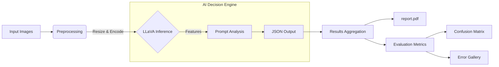

# 🌿 Plant Inspector AI

> **Automated Quality Control for Plant Imaging using LLaVA Vision Models.**

**Plant Inspector AI** is a robust tool designed to classify plant images into **GOOD** (viable plants) or **BAD** (empty pots/debris) categories using state-of-the-art Multimodal LLMs. It provides not just a label, but a detailed reasoning for every decision, along with comprehensive evaluation metrics.

---

## 🚀 Key Features

*   **🧠 Visual Intelligence**: Uses `llava:34b` (hosted remotely) to "see" and understand image content.
*   **📊 Dual Reporting**:
    *   **Qualitative**: A visual PDF report showing every image with its classification and reasoning.
    *   **Quantitative**: Detailed metrics including Confusion Matrix, Accuracy, Precision/Recall, and Error Analysis.
*   **⚡ Smart Resizing**: Automatically optimizes images for model inference (max 1024px) to ensure speed and accuracy.
*   **🛠️ Flexible Inputs**: Works with organized folders (`GOOD`/`BAD`) or simple CSV label files.

---

## 📖 How It Works



## 🛠️ Setup

1.  **Dependencies**: Ensure you have Python installed. Install the required libraries:
    ```bash
    pip install requests pillow matplotlib scikit-learn
    ```
2.  **Configuration**: The script is pre-configured to connect to the internal Ollama server (`http://luke.nt.fh-koeln.de:11434`).

---

## 🎮 Usage Guide

### 1. Prepare Your Data
Place your images in the `images/` directory.

### 2. (Optional) Provide Ground Truth
To generate evaluation metrics (Accuracy, Confusion Matrix), you need to tell the system what the "correct" answer is. You have two options:

*   **Option A: CSV File (Recommended)**
    Create a `labels.csv` file in the root directory:
    ```csv
    filename,y_true
    plant_01.jpg,GOOD
    empty_pot_02.jpg,BAD
    ```
*   **Option B: Folder Structure**
    Organize images into subfolders:
    ```text
    images/
    ├── GOOD/
    │   ├── plant_01.jpg
    └── BAD/
        ├── empty_pot_02.jpg
    ```

### 3. Run the Inspector
Execute the main script:

```bash
python classify_fotos.py
```

The system will:
1.  Classify every image in `images/`.
2.  Print real-time JSON results to the console.
3.  Generate reports.

---

## 📂 Output Gallery

After a run, check the generated artifacts:

| File | Description |
| :--- | :--- |
| **`report.pdf`** | **Visual Overview**. A 2x2 grid of all images with their predicted labels and the specific reason the AI gave. |
| **`results.json`** | **Raw Data**. A machine-readable log of all predictions. |
| **`reports/`** | **Evaluation Suite** (Only if labels are provided): |
| ├── `predictions.csv` | Side-by-side comparison of `y_true` vs `y_pred`. |
| ├── `confusion_matrix.pdf` | Heatmap showing where the model excels or fails. |
| ├── `metrics.pdf` | Professional classification report (F1-score, Recall, etc.). |
| └── `errors.pdf` | **Error Gallery**. A dedicated report showing ONLY the mistakes, helping you debug the model or data. |

---

## 💡 Troubleshooting

*   **"Reports are empty?"**
    *   This happens if the system couldn't find any ground truth labels. Ensure `labels.csv` exists or your folders are named `GOOD`/`BAD`.
*   **"Error loading image"**
    *   The file might be corrupted or not a valid image format. The script skips these gracefully.

---

**Happy Planting! 🌱**
